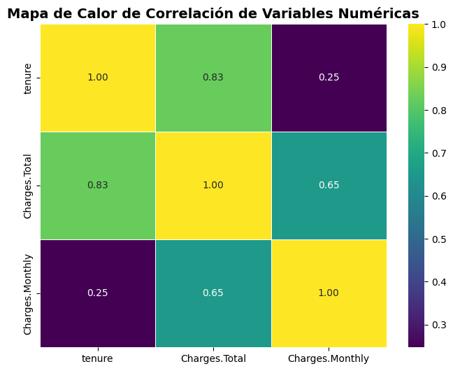

# 📴 Análisis de Abandono de clientes - TelecomX LATAM

Este proyecto explora los datos de clientes de TelecomX en LATAM,  utilizando distintas librerías de Python, como pandas, y visualizaciones con seaborn y matplotlib. A través de gráficos e insights, se identifican patrones de comportamiento de clientes, respecto de la tasa de abandono de los clientes a la compañía.

---

## 📚 Índice

1. [📌 Propósito del Análisis](#-propósito-del-análisis)
2. [📁 Estructura del Proyecto](#-estructura-del-proyecto)
3. [💻 Proceso ETL](#-proceso-etl)
4. [📊 Ejemplos de Gráficos e Insights](#-ejemplos-de-gráficos-e-insights)

---

## 📌 Propósito del Análisis

El propósito de este análisis es:

- Realizar un proceso de extracción de la inforación y transformación de los datos de clientes de TelecomX.
- Identificar los principales factores que influencian en el abandono de los clientes.
- Identificar patrones y correlaciones relevantes para el negocio.
- Brindar **insights accionables** para la toma de decisiones comerciales.
- Preparar la base de datos para un futuro modelo predictivo

---

## 📁 Estructura del Proyecto

| Carpeta/Archivo               | Descripción                                                  |
|------------------------------|--------------------------------------------------------------|
| `TelecomX_LATAM.ipynb`      | Notebook principal con el análisis exploratorio              |
| `Images/`                    | Carpeta con gráficos exportados desde el notebook            |
| `README.md`                  | Archivo con documentación del proyecto                       |

---
## 💻 Proceso ETL

### Extracción, Transformación y Carga
- Se realiza la extracción de la base de datos de clientes de telecomX que se encontraba en formato JSON
- Se transforman los datos, cambiando el formato a letras minúsculas, quitando caracteres innecesarios y modificando valores nulos
- Se carga la base para el análisis
---

## 📊 Ejemplos de Gráficos e Insights

En este apartado se expondrán los principales gráficos que permiten sacar ciertos patrones a la hora de observar el abandono de los clientes al servicio prestado por la compañía.

### 📈 Abandono de los clientes a la compañia

> **Insight:** Se obseva que solo el 25,8% de los clientes abandonan la compañía. Del total de clientes, 7.256 por lo tanto, 1.869 abandonan la empresa.

---

### 📉 Participación en el abandono por variable categórica

> **Insight:** Este análisis debe realizarse con una comparación de la cantidad de clientes que se encuentran en cada grupo. Por ejemplo hay 3.407 mujeres en la base de datos y 3.669 hombres clientes, por lo tanto esta variable se encuentra balanceada, es por ello que las participaciones tienen sentido, permanecen en ambos casos aproximadamente el 74% de los clientes. Ahora cuando observamos si los clientes son mayores o menores de 65 años, se deduce que la mayor cantidad de clientes se concentra en el estrato menores de 65, el total de clientes mayores de 65 no alcanzan a los que abandonan que son menores de 65 años (1.393 clientes contra 1.182 clientes mayores de 65 años). Cuando se miran las participaciones se ve que en los mayores de 65 años la proporción de clientes que abandona es mayor que en la de menores de 65 años, no obstante, la empresa debería buscar la manera de retener aquellos de menor rango etáreo que concentran la mayor proporción de clientes.
> **Insight:** Un punto a destacar es quienes reciben servicio de internet por fibra óptica que tienen una alta tasa de abandono, algo similar ocurre con quienes no tiene servicio de seguridad online, online back up, protección del dispositivo y soporte técnico, es por ello que pensar en un servicio con prestaciones integradas puede hacer que la tasa de abandono caiga.
> **Insight:** En el caso de contrato mes a mes 1.655 clientes abandonan la compañía, es por ello que pensar en contratos con mayor horizonte temporal o con beneficios por un año, para que se mantengan dentro de la empresa.
> **Insight:** En el caso de método de pago el cheque electrónico presenta un abandono de 1.071 clientes es por ello, que pensar en promocionar el resto de los métodos de pagos que tienen menor abandono o corroborar que los clientes no esten teniendo problemas al momento de realizar el pago.

---

### 📉 Abandono por variables numéricas

> **Insight:** De las variables numéricas se corrobora la información obtenidad del análisis anterior cuando los cargos son mensuales el abandono muestra una concentración hacia gastos más altos, no obstante esto no sucede con el cargo total, vinculado con la existencia de contratos mes a mes donde se observaba una alta tasa de abondono. Nuevamente, el ternure, mide los meses de contrato del cliente, a medida que aumenta la cantidad de meses el abandono cae. Pensar en contratos más largos o con beneficios para una cantidad de meses puede der una buena política de retención de clientes

---
### Correlación de las variables numéricas

> **Insight:** Se observa una alta correlación entre los cargos totales y la permanencia de los clientes o cantidad de meses de contrato del cliente, relación que se ve disminuida cuando se observa el vínculo de la cantidad de meses de contrato del cliente y el cargo mensual.

---

